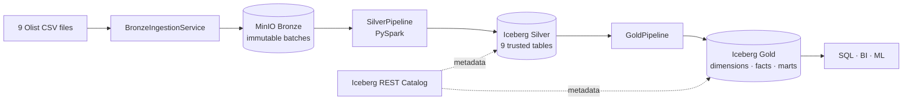
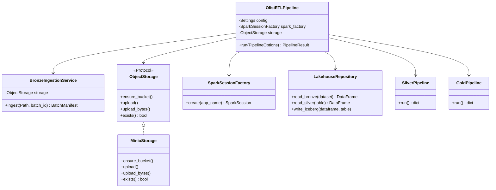
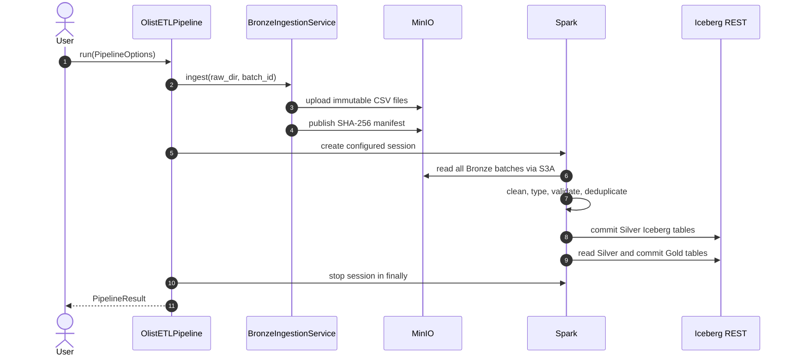
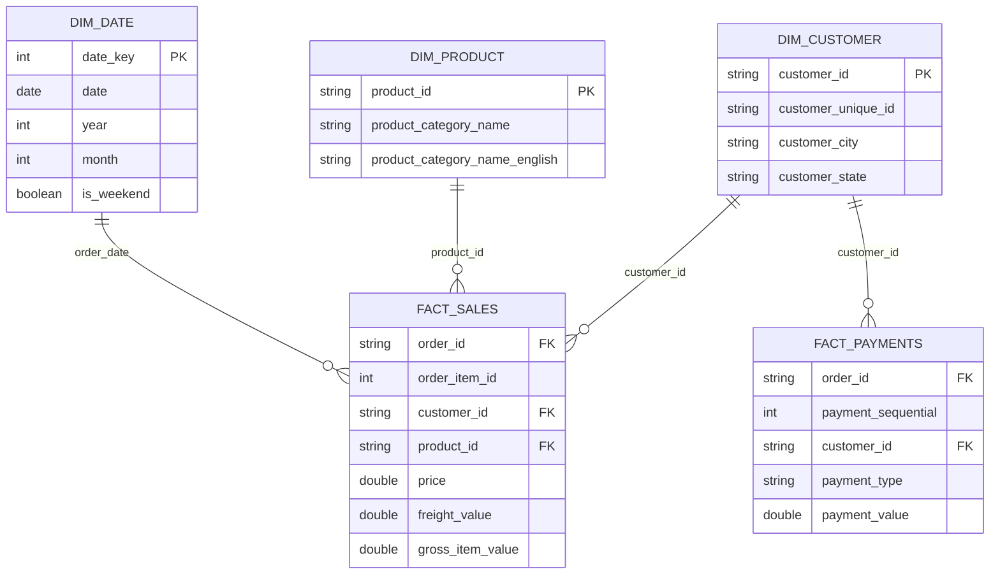

# Olist Lakehouse


Production-style batch data lakehouse cho bộ dữ liệu thương mại điện tử Olist.
Dự án đưa CSV từ local vào MinIO, chuẩn hóa bằng PySpark và xuất các bảng
Apache Iceberg sẵn sàng cho BI/analytics.

## Tổng quan



Pipeline đã được chạy end-to-end với dữ liệu thật:

| Layer | Kết quả |
|---|---:|
| Bronze | 9 CSV + SHA-256 manifest cho mỗi batch |
| Silver | 9 Iceberg tables |
| Gold | 7 analytics tables |
| Tests | 23 passed |

## Điểm nổi bật

- Batch ingestion bất biến theo `batch_id`, có thể replay và audit.
- Idempotent upload: chạy lại cùng batch không tạo bản sao CSV.
- Explicit Spark schema; production code không dùng `inferSchema`.
- Quality gates cho required keys trước khi ghi Silver.
- Khử trùng lặp theo business key của từng dataset.
- Iceberg format v2, ACID table và REST catalog.
- OOP có chủ đích: Factory, Repository, Service, Protocol và dependency injection.
- Pure DataFrame transformations để logic nghiệp vụ dễ đọc và unit test.
- Unit tests không phụ thuộc hạ tầng; integration tests kiểm tra MinIO/Iceberg thật.

## Kiến trúc phần mềm



Class được dùng cho đối tượng có dependency hoặc lifecycle. Các transformation
không có state vẫn là hàm thuần; ép chúng vào class chỉ làm code khó test hơn.

## Data flow



## Cấu trúc repository

```text
thltdl/
├── data/raw/                     # 9 source CSV files
├── notebooks/
│   ├── 01_data_exploration.ipynb
│   └── 02_lakehouse_validation.ipynb
├── src/
│   ├── pipeline.py               # Application orchestrator + CLI
│   ├── bronze/
│   │   └── ingest_olist.py       # Ingestion service + manifest models
│   ├── common/
│   │   ├── config.py             # Immutable settings
│   │   ├── io.py                 # Lakehouse repository
│   │   ├── minio_storage.py      # Storage protocol + MinIO adapter
│   │   ├── quality.py            # Quality gates and reports
│   │   ├── schemas.py            # Explicit source schemas
│   │   └── spark.py              # Spark session factory
│   ├── silver/                   # Trusted transformations + pipeline
│   └── gold/                     # Dimensions, facts, marts + pipeline
├── test/
│   ├── unit/
│   └── integration/
├── Dockerfile.spark
├── docker-compose.yaml
├── Makefile
└── pyproject.toml
```

Các file `__init__.py` trống là cần thiết: chúng đánh dấu Python packages và
giữ import ổn định giữa CLI, pytest, notebook và container.

## Mô hình dữ liệu



### Grain của Gold tables

| Table | Grain |
|---|---|
| `dim_customer` | Một dòng cho mỗi `customer_id` |
| `dim_product` | Một dòng cho mỗi `product_id` |
| `dim_date` | Một dòng cho mỗi ngày có giao dịch |
| `fact_sales` | Một dòng cho mỗi order item |
| `fact_payments` | Một dòng cho mỗi payment sequence của order |
| `monthly_sales` | Một dòng cho mỗi tháng |
| `category_performance` | Một dòng cho mỗi product category |

## Chạy dự án

### Yêu cầu

- Docker Engine và Docker Compose v2
- Khuyến nghị tối thiểu 8 GB RAM
- Các CSV Olist nằm trong `data/raw/`

### 1. Khởi động hạ tầng

```bash
cp .env.example .env
docker compose up -d --build
```

MinIO Console: <http://localhost:9001>  
Jupyter: <http://localhost:8888>  
Iceberg REST Catalog: <http://localhost:8181>

### 2. Chạy toàn bộ pipeline

```bash
docker compose exec -w /home/iceberg/project spark-iceberg \
  python3 -m src.pipeline --batch-id batch_001
```

Hoặc dùng Makefile:

```bash
make pipeline
```

### 3. Thêm batch mới

Thư mục batch mới phải chứa đủ 9 CSV với đúng tên nguồn:

```bash
docker compose exec -w /home/iceberg/project spark-iceberg \
  python3 -m src.pipeline \
  --raw-dir /path/to/new/batch \
  --batch-id batch_002
```

Bronze layout:

```text
s3://olist-lake/bronze/olist/
├── customers/batch_id=batch_001/olist_customers_dataset.csv
├── customers/batch_id=batch_002/olist_customers_dataset.csv
├── orders/batch_id=batch_001/olist_orders_dataset.csv
└── _manifests/
    ├── batch_001.json
    └── batch_002.json
```

### Chạy từng layer

```bash
# Bronze only
make ingest

# Rebuild Silver từ tất cả Bronze batches
make silver

# Rebuild Gold từ Silver hiện tại
make gold
```

## Dùng như Python API

```python
from pathlib import Path

from src.pipeline import OlistETLPipeline, PipelineOptions

result = OlistETLPipeline().run(
    PipelineOptions(
        raw_dir=Path("data/raw"),
        batch_id="batch_001",
    )
)

print(result.manifest)
print(result.silver_rows)
print(result.gold_rows)
```

## Kiểm thử và chất lượng code

```bash
# Unit tests, không yêu cầu MinIO/Iceberg
make test-unit

# Toàn bộ unit + integration tests
docker compose exec -w /home/iceberg/project spark-iceberg pytest -q

# Kiểm tra format
docker compose exec -w /home/iceberg/project spark-iceberg \
  python3 -m black --check src test main.py
```

Test strategy:

- Unit tests kiểm tra transformation và business rules.
- `InMemoryStorage` kiểm tra ingestion/idempotency qua dependency injection.
- Integration tests đọc Bronze thật từ MinIO và xác minh Iceberg v2 tables.

## Data quality rules

| Dataset | Business key | Quy tắc chính |
|---|---|---|
| customers | `customer_id` | Trim key, chuẩn hóa city/state, deduplicate |
| orders | `order_id` | Required customer, lowercase status, parse timestamps |
| order_items | `order_id`, `order_item_id` | Parse timestamp, giá âm thành null |
| payments | `order_id`, `payment_sequential` | Chuẩn hóa type, giá trị âm thành null |
| products | `product_id` | Sửa typo column, chuẩn hóa category |
| sellers | `seller_id` | Chuẩn hóa city/state |
| reviews | `review_id`, `order_id` | Score 1–5, parse timestamps |
| geolocation | ZIP prefix + coordinates | Chuẩn hóa city/state, distinct rows |
| category_translation | category name | Chuẩn hóa song ngữ, deduplicate |

## Cấu hình

Tất cả runtime settings nằm trong [`.env.example`](.env.example). Hai loại
endpoint được tách rõ:

- Khi chạy Python từ host: dùng `localhost`.
- Khi chạy trong Docker Compose: service dùng `minio` và `rest` qua internal DNS.

Không commit `.env` vì file này có thể chứa credentials thật.

## Quyết định thiết kế

1. **MinIO là storage, Spark là compute, Iceberg là table format.** Ba vai trò
   này được tách riêng để có thể thay thế độc lập.
2. **Bronze bất biến.** Batch mới không overwrite dữ liệu nguồn; manifest hỗ trợ
   traceability và kiểm tra checksum.
3. **Silver rebuild từ mọi Bronze batch.** Cách này đơn giản, deterministic và
   phù hợp quy mô dataset hiện tại. Khi dữ liệu lớn hơn có thể chuyển sang
   incremental `MERGE INTO`.
4. **Gold có grain rõ ràng.** Điều này ngăn double counting khi join fact và
   dimensions.
5. **OOP ở boundary, functional ở transformation.** Service/repository quản lý
   dependency; hàm Spark giữ logic dữ liệu dễ kiểm thử.

## Troubleshooting

### Pipeline không kết nối được MinIO

```bash
docker compose ps
docker compose logs minio
docker compose logs mc
```

Kiểm tra `MINIO_ENDPOINT`: trong container phải là `http://minio:9000`, không
phải `localhost`.

### Gold chạy trước Silver

Chạy toàn pipeline hoặc tạo Silver trước:

```bash
make silver
make gold
```

### Dừng hạ tầng

```bash
make down
```

MinIO data được giữ trong Docker volume `minio-data`; `docker compose down -v`
mới xóa volume này.

## Hướng phát triển tiếp theo

- Incremental Iceberg `MERGE INTO` theo watermark/batch manifest.
- Quarantine table cho malformed records thay vì chỉ fail-fast.
- Airflow/Dagster orchestration và retry policy.
- Great Expectations hoặc Soda quality contracts.
- Trino + dbt semantic/serving layer.
- CI pipeline chạy format, unit tests và Docker integration tests.
- OpenTelemetry metrics và structured logging.

## License và dữ liệu

Dự án dùng cho mục đích học tập/portfolio. Bộ dữ liệu Olist thuộc về nguồn phát
hành tương ứng; hãy kiểm tra license của dataset trước khi phân phối lại.
